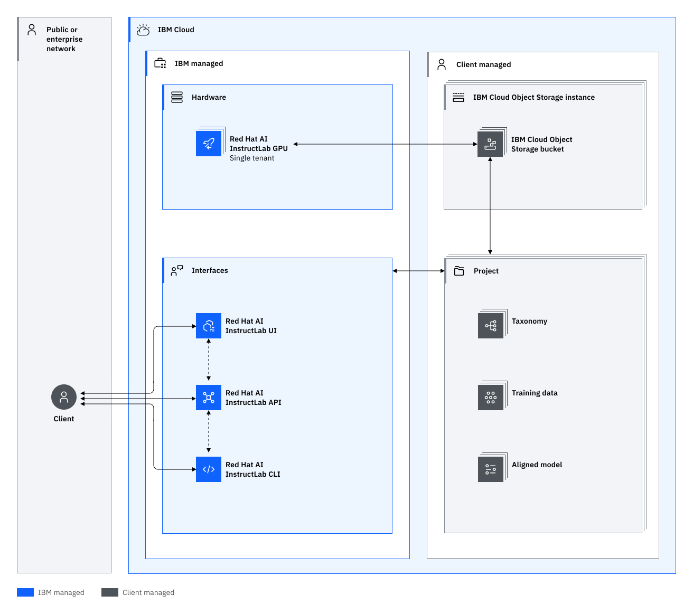

---

copyright:
  years: 2025, 2025
lastupdated: "2025-04-14"

keywords: instructlab, workload isolation, architecture, data, tenants

subcollection: instructlab

---

{{site.data.keyword.attribute-definition-list}}

# Learning about {{site.data.keyword.instructlab_full_notm}} architecture and workload isolation
{: #compute-isolation}

{{site.data.keyword.instructlab_full_notm}} operates on a Software-as-a-Service (SaaS) model, ensuring that operations run on a dedicated RHEL AI GPU machine. After completion, all data is securely wiped, guaranteeing complete isolation between tenant workloads.
{: shortdesc}

By understanding the following architectural principles and isolation levels, you can select the solution that best aligns with your workload requirements. Our commitment to data isolation and security is unwavering, ensuring that your operations are conducted in a safe, controlled, and independent environment.

## {{site.data.keyword.instructlab_short}} architecture
{: #architecture}

{{site.data.keyword.instructlab_short}} is a comprehensive, cloud-based service designed for data generation and fine-tuning tasks. Our architecture is built on a Software-as-a-Service (SaaS) model, which inherently provides a high level of isolation between tenant workloads. Each operation, whether data generation or fine-tuning, is executed on a dedicated RHEL AI GPU machine. This dedicated resource allocation ensures that no two tenants share the same physical or logical resources, thereby preventing any potential data leakage or interference.

After an operation completes, all data is meticulously wiped from the system. This practice not only adheres to stringent data privacy standards but also ensures that no residual data from one tenant's workload can impact another. This rigorous data sanitization process, coupled with our SaaS-based architecture, provides a robust isolation mechanism, making {{site.data.keyword.instructlab_short}} an ideal choice for running sensitive workloads in the cloud.

Review the following sample architecture for {{site.data.keyword.instructlab_full_notm}}.  

{: caption="Architecture and data isolation diagram" caption-side="bottom"}{: external download="data-isolation.svg"}

### Storage
{: #arch-data}

Your {{site.data.keyword.instructlab_short}} artifacts, logs, and results are stored in your own IBM Cloud Object Storage bucket. For information on IBM Cloud Object Storage, see [What is IBM Cloud Object Storage?](/docs/cloud-object-storage?topic=cloud-object-storage-about-cloud-object-storage).

### Backend components
{: #arch-backend}

{{site.data.keyword.instructlab_short}} operations RHEL AI GPU machines that are dedicated to you during the data generation and fine-tuning operations. 

### Security and access control
{: #arch-access}

You have full control over the IAM policies that determine what actions can be executed in your account, and can implement IAM-controlled access to keep data separated within individual projects in your account. You can also implement IBM Cloud Monitoring with Activity Tracker to audit and track API requests. All API requests are authenticated an authorized through IBM Cloud IAM. 

For more information, see [Protecting Red Hat AI InstructLab resources with context-based restrictions](/docs/instructlab?topic=instructlab-cbr&interface=ui).

### Data Flow
{: #arch-dataflow}

Review the {{site.data.keyword.instructlab_short}} data flow. 

1. Data generation and fine-tuning operations run on dedicated RHEL AI GPU machines.
2. Artifacts, logs, and results are uploaded to your IBM Cloud Object Storage bucket.
3. Data is subsequently wiped from the machine, providing a clean run for subsequent operations. 

## {{site.data.keyword.instructlab_short}} workload isolation
{: #workload-isolation}

When you use {{site.data.keyword.instructlab_short}}, your operations, including data generation and fine-tuning, are executed on a dedicated RHEL AI GPU machine so that no two tenants share the same physical or logical resources. After an operation is complete, all data is meticulously wiped from the system. This practice adheres to stringent data privacy standards, ensures that no residual data from one tenant's workload remains on the dedicated machine, and prevents any potential data leakage or interference. 
