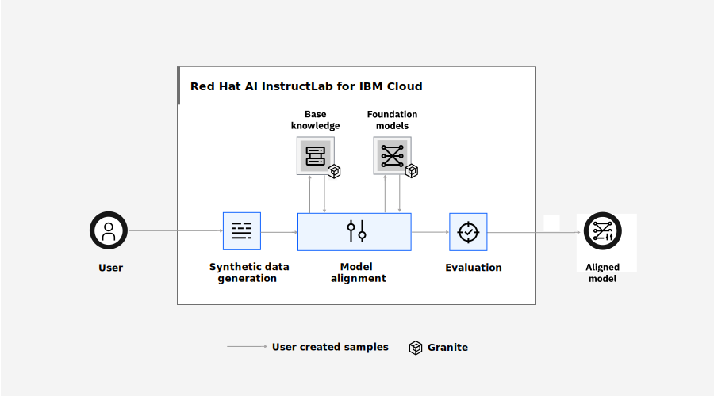

---

copyright:
  years: 2024, 2024
lastupdated: "2024-10-31"

keywords: instructlab, ai

subcollection: instructlab

content-type: tutorial

services: instructlab
account-plan: paid
completion-time: 30m

---

{{site.data.keyword.attribute-definition-list}}


# Getting started with {{site.data.keyword.instructlab_full_notm}}
{: #getting-started}
{: toc-content-type="tutorial"}
{: toc-services="instructlab"}
{: toc-completion-time="30m"}

Get ready to dive into [AI](#x3448902){: term} with {{site.data.keyword.instructlab_full}}! InstructLab is an open source project created by IBM and Red Hat to be a cost-effective entry point into the world of [machine learning](#x8397498){: term}.
{: shortdesc}


## Prerequisites
{: #instructlab-pre}

Before you begin, you must have a paid {{site.data.keyword.cloud}} account.


## Get familiar with the capabilities
{: #get-familiar}

If you are new to machine learning, you are in the correct place. To use InstructLab, you do not need to have any preexisting knowledge. You do not even need to have an idea for what to create yet. Let's start by just getting familiar with the concepts and what kinds of things you can do with the technology.

[Generative AI](#x10298036){: term} starts with a [large language model (LLM)](#x10298052){: term}. With a prompt, these models can take sets of data and provide a statistically probable output for that prompt. You can automatically generate a data set that is similar to real data, and then use it to train the model to get the most probable output possible.

With InstructLab, you can use an existing, pre-trained LLM compiled by a community of contributors, and then generate the data to further train the model. By incorporating {{site.data.keyword.cloud_notm}}, you have a place to store the taxonomy, the informational structure, for the model as you modified it and train the model on an ongoing basis.

{: caption="Task flow diagram." caption-side="bottom"}{: external download="task-flow.svg"}


## Request access
{: #access}
{: step}

The {{site.data.keyword.instructlab_short}} service is under development and is not yet generally available. The project is currently at capacity with a limited number of critical test projects involved. As the service develops, capacity is expected to added. For your project to be considered, send an email to `instructlab@ibm.com` with the following information. You can find your account ID on the [Account settings](https://cloud.ibm.com/account/settings){: external} page. Allow 1-2 business days for the request to be processed. After you are allowlisted, you can access the InstructLab UI and CLI. 


To
```txt
instructlab@ibm.com
```
{: codeblock}

Subject
```txt
Request to allowlist account: <account_id> to use IBM Cloud InstructLab Service.
```
{: codeblock}

Body
```txt
Add account <account_id> to the allowlist for the IBM Cloud InstructLab service.
Team: <team>
Approval given by: <approver|dan.waugh@ibm.com>
Purpose: <short summary of type of usage for the service>
```
{: codeblock}

While you wait for your account to be added to the allowlist, you can complete most of these steps. 


## Install the CLIs
{: #cli-install}
{: step}

You must use `ilab` plugin version 0.0.6 or later. If you already have the plugin installed, run `ibmcloud ilab --version` to verify and, with the IBM VPN connected, run the `ibmcloud plugin update -r stage` command, if necessary.
{: important}
{: cli}

1. Install the [{{site.data.keyword.cloud_notm}} CLI](/docs/cli?topic=cli-getting-started).

1. Add the `ilab` plug-in repo.{: cli}

    ```sh
    ibmcloud plugin repo-add stage https://plugins.test.cloud.ibm.com
    ```
    {: pre}

    Example output.
    ```sh
    OK
    https://plugins.test.cloud.ibm.com added as 'stage'.
    ```
    {: screen}

1. Install the plug-in. You must be connected to the IBM VPN.{: cli}

    ```sh
    ibmcloud plugin install ilab -r stage
    ```
    {: pre}

    ```sh
    Looking up 'ilab' from repository 'stage'...
    Plug-in 'ilab 0.0.1' found in repository 'stage'
    Plug-in 'ilab 0.0.1' was already installed. Do you want to re-install it or not? [y/N] > y
    Attempting to download the binary file...
    16.89 MiB / 16.89 MiB [============================================] 100.00% 4s
    17713074 bytes downloaded
    Installing binary...
    OK
    Plug-in 'ilab 0.0.1' was successfully installed into /Users/derekpoindexter/.bluemix/plugins/ilab. Use 'ibmcloud plugin show ilab' to show its details.
    ```
    {: screen}

1. Log in to your {{site.data.keyword.cloud_notm}} account from the CLI.{: cli}
    ```sh
    ibmcloud login -a https://cloud.ibm.com --sso -r us-east
    ```
    {: pre}

1. If you plan to allow InstructLab to create Cloud Object Storage Instance resources for you, target a resource group. Learn more about storage in the next section, [Choose a storage setup](#storage).{: cli}
    ```sh
    ibmcloud target -g <resource_group>
    ```
    {: pre}

1. Optional: Install the [Git CLI](https://docs.github.com/en/get-started/getting-started-with-git/set-up-git) to store and manage your taxonomies.


## Choose a storage setup
{: #storage}
{: step}

An {{site.data.keyword.cos_full}} (COS) bucket is required to store all inputs used or outputs generated by InstructLab, including the taxonomy, the generated data, and the final fine-tuned model. 

Start by authorizing the InstructLab service in your account. Then, if you do not have a COS service instance or bucket yet, you can either allow them to be created for you later or you can create them yourself.

If the service instance or bucket are created for you, the details for those resources are saved for you. When you run CLI commands, you do not have to include the options to define them.{: cli}

### Give InstuctLab permission to create and update COS artifacts
{: #storage-auth}

Provide InstructLab with `Writer` access to create COS service instances and buckets and to write to buckets. The logged-in user must also have the same permission.

1. Create the authrorization policy for InstructLab.
    ```sh
    ibmcloud iam authorization-policy-create Writer --source-service-name instructlab --target-service-name cloud-object-storage
    ```
    {: pre}

    If you already have COS resources to use, you can scope the authorization to only those resources.
    ```sh
    ibmcloud iam authorization-policy-create Writer --source-service-name instructlab --target-service-name cloud-object-storage --target-service-instance-id <cloud-object-storage-instance-id> --target-resource <cloud-object-storage-bucket> --target-resource-type bucket
    ```
    {: pre}

1. Verify that the authorization policy was created.
    ```sh
    ibmcloud iam authorization-policies
    ```
    {: pre}

    Result when authorization is not scoped to a specific COS bucket:
    ```txt
    Getting authorization policies under account abc1234 as user...
    OK

    ID:                        <id>
    Source service name:       instructlab
    Source service instance:   All instances
    Target service name:       cloud-object-storage
    Target service instance:   All instances
    Roles:                     Writer
    ```
    {: screen}

    Result when authorization is scoped to a specific COS bucket:
    ```txt
    Getting authorization policies under account abc1234 as user...
    OK

    ID:                        <id>
    Source service name:       instructlab
    Source service instance:   All instances
    Target service name:       cloud-object-storage
    Target service instance:   bucket
    Roles:                     Writer
    ```
    {: screen}

1. If necessary, give the `Writer` permission to the logged-in user. Include the Cloud Object Storage service instance ID from the previous step.

    ```sh
    ibmcloud iam user-policy-create <user> --roles Writer --service-instance <cloud-object-storage-instance-id>
    ```
    {: pre}

### Optional: Create your own COS instance or bucket
{: #storage-manual}

Instead of allowing a COS service instance and bucket to be created for you later, you can create them yourself.

Before you begin, [install the COS CLI plugin](/docs/cloud-object-storage?topic=cloud-object-storage-ic-cos-cli).{: cli}

1. If you do not have a service instance yet, [provision a COS instance](https://cloud.ibm.com/objectstorage/create){: external} in your account.

1. Decide if you want to allow the bucket to be created automatically later or create the bucket yourself.

    - If you want the bucket created automatically later, in the user interface for the COS service instance, click **Details** and copy the **CRN**, which can be used as the service instance ID later.{: ui}

    - To create the bucket yourself now, in the COS instance, create a custom bucket. Note the bucket name for later.{: ui}

    - If you want the bucket created automatically later, run the following command to get the COS service instance GUID.{: cli}

        ```sh
        ibmcloud resource service-instance <service_name>
        ```
        {: pre}

        Output
        ```sh
        Name:                   Cloud Object Storage-qt-kkb-instructlab-071524
        ID:                     crn:v1:bluemix:public:cloud-object-storage:global:a/xxxxxxxxxxxx:xxx-xxx-xxx-xxx-xxx::
        GUID:                   xxx-xxx-xxx-xxx-xxx
        ...
        ```
        {: screen}

    - To create the bucket yourself now, see [Create a new bucket](/docs/cloud-object-storage?topic=cloud-object-storage-ic-cos-cli#create-a-new-bucket) in the COS documentation. Note the bucket name for later.{: cli}


## Prepare a taxonomy
{: #taxonomy}
{: step}

In this example, use the Git CLI to clone and update the InstructLab [community taxonomy](https://github.com/instructlab/taxonomy){: external}.

1. Fork the [community taxonomy repo](https://github.com/instructlab/taxonomy) by clicking **Fork** and completing the steps.

1. Clone your fork to your local machine.
    ```sh
    git clone https://github.com/<my-org>/taxonomy
    ```
    {: pre}

1. Optional: Make updates to the taxonomy in your fork. This example adds rhyming questions to the [linguistics](https://github.com/instructlab/taxonomy/tree/main/compositional_skills/grounded/linguistics) directory.

    a. In your cloned fork, create a `/instructlab-taxonomy/compositional_skills/grounded/linguistics/rhyming_words/qna.yaml` file.

    b. In the `qna.yml` file, add a question related to rhyming words.
    ```txt
    - answer: 'Here are two rhyming words for "cave":


        1\. Brave

        2\. Gave


        '
    question: 'Give me two words that rhyme with cave

        '

    ```
    {: codeblock}

    c. If your additions include reference documents in Github, such as [this example](https://github.com/instructlab/taxonomy/blob/main/knowledge/science/animals/birds/black_capped_chickadee/qna.yaml#L185), you can use public `github.com` repositories and IBM internal `github.ibm.com` repositories. 

    ```txt
    document:
    repo: https://github.ibm.com/<organization>/<repository>
    commit: <commit_sha>
    patterns:
        - <filename>.md
    ```
    {: codeblock}

    If you are using a private repository, you must give the `instructlab-ibm` user read access to the repository. Click **Settings** > **Collaborators** and in the **Manage Access** section, click **Add people**. Invite `instructlab-ibm`. The invitation is labeled as `pending` for 1-2 business days until the invitation is accepted. Until the invitation is accepted, you can continue to work with the taxonomy and generate data, but wait to complete the training steps.
    {: important}

    d. Save the changes and push the changes to the fork.

    f. Optional: Learn more about how to modify the [taxonomy](https://github.com/instructlab/taxonomy) for the model.

    g. Optional: [Validate the updated taxonomy](/docs/instructlab?topic=instructlab-ts-debug#version).


## Add your taxonomy to COS by using the console
{: #taxonomy-add-ui}
{: step}
{: ui}

After you receive access to InstructLab, store your taxonomy in COS.

1. From a command-line terminal, change directories to the parent directory of your taxonomy directory.
    ```sh
    cd <taxonomy_repo_parent_dir>
    ```
    {: pre}

    Example if your taxonomy is in `~/documents/clones/taxonomy`:
    ```sh
    cd ~/documents/clones
    ```
    {: pre}

1. TAR the local taxonomy. Use alphanumeric characters in the taxonomy name.

    ```sh
    tar -czvf <taxonomy_name>.tar.gz <taxonomy_dir_name>
    ```
    {: pre}

    Example if your taxonomy is in `~/documents/clones/taxonomy`:
    ```sh
    tar -czvf taxonomy.tar.gz taxonomy
    ```
    {: pre}

1. In the console, open the [InstructLab service](https://cloud.ibm.com/instructlab/overview).

1. Click **Taxonomies** > **Upload**.

1. Select the `.tar.gz` file, give the taxonomy an alphanumeric name, select the COS instance and bucket details to use, and click **Upload**.


## Add your taxonomy to COS by using the CLI
{: #taxonomy-add-cli}
{: step}
{: cli}

After you receive access to InstructLab, store your taxonomy in COS.

1. Optional: Run the `init` command to set and save COS bucket details and credentials, which can simplify your commands going forward.  If you don't want to save these details and want to include them in the `add` command instead, you can continue to the next step.

    If you want the COS service instance or bucket to be created automatically later, you do not need to add those options here. The details are saved for you.
    {: tip}

    ```sh
    ibmcloud ilab config init \
    --taxonomy-path <local-path-to-taxonomy> \
    --taxonomy-path-cos <taxonomy-path-in-cos-bucket> \
    --cos-bucket <bucket_name> \
    --cos-endpoint <endpoint> \
    --cos-region <region> \
    --cos-service-instance-id <service_id>
    ```
    {: pre}

    | Parameter | Description |
    | -------------- | -------------- |
    | `--taxonomy-path <local_directory_path` | Required. The local directory path to the taxonomy file. |
    | `--taxonomy-path-cos <directory_path>` | Optional. The relative directory path within the COS bucket to the taxonomy file. |
    | `--cos-bucket <bucket_name>` | Optional. If you are adding a taxonomy to an existing bucket, include the name. You can find this name on the **Buckets** tab of your COS instance. If you want the bucket to be created for you, you can enter a name for it. If no name is specified and a bucket does not exist yet, a bucket is created that is named `instructlab_TIME`, where `TIME` is the current epoch time. |
    | `--cos-endpoint <endpoint>` | Optional. Use the public, regional endpoint. For example `https://s3.us-east.cloud-object-storage.appdomain.cloud`. You can find these in the **Endpoints** tab of the COS console. |
    | `--cos-region <region>` | Optional. The default value is `us-east`. |
    | `--cos-service-instance-id <service_id>` | Optional. If you have a COS service instance to use, include the service ID. In the user interface for the COS service instance, click **Details**. Note the **CRN**, which can be used for the service instance ID. If you want one to be created for you, it is created with the name `InstructLab`.|
    {: caption="Understanding this command's components" caption-side="bottom"}

    Example command to save the taxonomy path, but have the COS service instance and bucket created for you later.
    ```sh
    ibmcloud ilab config init \
    --taxonomy-path /Users/USER/instructlab-taxonomy \
    ```
    {: pre}

    Example command to save the taxonomy path and the details for an existing COS service, but have the COS bucket created for you later.
    ```sh
    ibmcloud ilab config init \
    --taxonomy-path /Users/USER/instructlab-taxonomy \
    --cos-service-instance-id existing_service_instance_id
    ```
    {: pre}

    Example command to save the taxonomy path and the details for an existing bucket.
    ```sh
    ibmcloud ilab config init \
    --taxonomy-path /Users/USER/instructlab-taxonomy \
    --cos-bucket existing-instruct-lab-bucket 
    ```
    {: pre}

1. Add the taxonomy to a COS bucket.
    ```sh
    ibmcloud ilab taxonomy add --name <name>
    ```
    {: pre}

    | Parameter | Description |
    | -------------- | -------------- |
    | `--name <taxonomy_name>` | Required. The name of the taxonomy as it is to be displayed in the COS bucket. Use alphanumeric characters in the taxonomy name.|
    | `--taxonomy-path <local_directory_path>` | Required if not specified with the `init` command. The local directory path to the taxonomy. |
    | `--taxonomy-path-cos <directory_path>` | Optional. The relative directory path within the COS bucket to the taxonomy file. |
    | `--cos-bucket <bucket_name>` | Optional. If you are adding a taxonomy to an existing bucket, include the name. You can find this name on the **Buckets** tab of your COS instance. If you want the bucket to be created for you, you can enter a name for it. If no name is specified and a bucket does not exist yet, a bucket is created that is named `instructlab_TIME`. |
    | `--cos-endpoint <endpoint>` | Optional. Use the public, regional endpoint. For example `https://s3.us-east.cloud-object-storage.appdomain.cloud`. You can find these in the **Endpoints** tab of the COS console. |
    | `--cos-region <region>` | Optional. The default value is `us-east`. |
    | `--cos-service-instance-id <service_id>` | Optional. If you have a COS service instance to use, include the service ID. In the user interface for the COS service instance, click **Details**. Note the **CRN**, which can be used for the service instance ID. If you want one to be created for you, it is created with the name `InstructLab`.|
    {: caption="Understanding this command's components" caption-side="bottom"}

    Example command to use the details that were saved with the `init` command.
    ```sh
    ibmcloud ilab taxonomy add --name test
    ```
    {: pre}

    Example command to have the COS bucket created for you in an existing service instance.
    ```sh
    ibmcloud ilab taxonomy add \
    --name test \
    --taxonomy-path /Users/USER/instructlab-taxonomy \
    --cos-service-instance-id existing_service_instance_id
    ```
    {: pre}

    Example command to use an existing bucket.
    ```sh
    ibmcloud ilab taxonomy add \
    --name test \
    --taxonomy-path /Users/USER/instructlab-taxonomy \
    --cos-bucket existing-instruct-lab-bucket 
    ```
    {: pre}


## What's next?
{: #next}

[Generate data from the taxonomy.](/docs/instructlab?topic=instructlab-data-generate)
