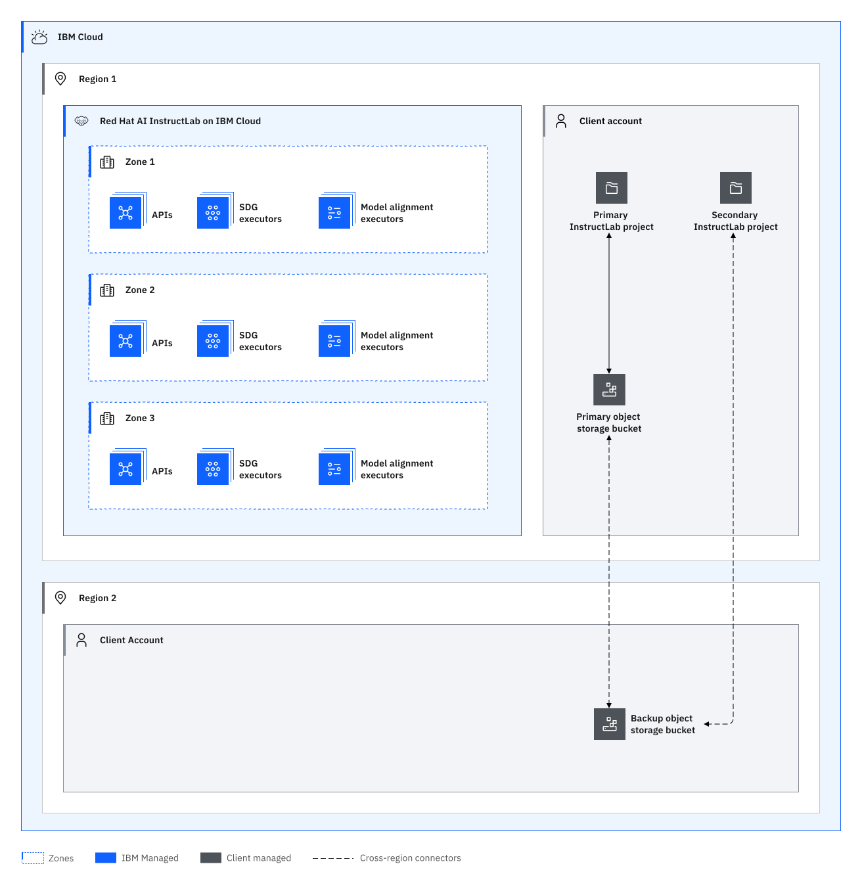

---

copyright:
  years: 2025, 2025
lastupdated: "2025-04-21"

keywords: HA for {{site.data.keyword.short_name}}, DR for {{site.data.keyword.short_name}}, {{site.data.keyword.short_name}} recovery time objective, {{site.data.keyword.short_name}} recovery point objective

subcollection: instructlab

---

{{site.data.keyword.attribute-definition-list}}

# Understanding high availability and disaster recovery for {{site.data.keyword.short_name}}
{: #ilab-ha-dr}

[High availability](#x2284708){: term} (HA) is the ability for a service to remain operational and accessible in the presence of unexpected failures. [Disaster recovery](#x2113280){: term} is the process of recovering the service instance to a working state.
{: shortdesc}

{{site.data.keyword.instructlab_short}} is a highly available regional service designed for availability during a zonal outage. {{site.data.keyword.instructlab_short}} is designed to meet the [Service Level Objectives (SLO)](/docs/resiliency?topic=resiliency-slo) with the Standard plan.

For more information about the available region and data center locations, see [Service and infrastructure availability by location](/docs/overview?topic=overview-services_region).


## High availability architecture
{: #ha-architecture}

{: caption="Architecture diagram" caption-side="bottom"}{: external download="data-isolation.svg"}

### High availability features
{: #ha-features}

{{site.data.keyword.instructlab_short}} supports the following high availability features:

| Feature | Description | Consideration |
| --- | --- | --- |
| Global load balancing | In the event of a node or availability zone failure, the service continues to run with API requests being routed through a global load balancer to the surviving HA instance nodes. Active synthetic data generation jobs and active model alignment jobs executing on nodes within the zone are retried on nodes in a different zone on failure automatically. In certain regions due to capacity constraints, model alignment nodes are deployed within one zone. When the zone is restored active model alignment jobs are automatically retried. | There may be a short period of time (seconds) between the outage and the global load balancer recognizing the failure, during which time, requests may be sent to the failed instance. |
{: caption="HA features for {{site.data.keyword.instructlab_short}}" caption-side="bottom"}

## Disaster recovery features
{: #dr-features}

{{site.data.keyword.instructlab_short}} supports the following disaster recovery features:

| Feature | Description | Consideration |
| --- | --- | --- |
| {{site.data.keyword.short_name}} follows a regional deployment model. | In the case of a regional failure APIs could become unavailable until the region is restored. | Other active regions where {{site.data.keyword.short_name}} is deployed to can be utilized to generate synthetic data and execute model alignments until the region is restored. |
| {{site.data.keyword.cos_short}} replication | {{site.data.keyword.short_name}} persists all SDG and aligned models into the client provided object storage bucket. Reference the {{site.data.keyword.cos_short}} service documentation for disaster recovery strategies. | You can use bucket replication to replicate taxonomy content, generated synthetic data, and aligned models to a different region. For more information, see [Understanding high availability and disaster recovery for {{site.data.keyword.cos_full}}](https://cloud.ibm.com/docs/cloud-object-storage?topic=cloud-object-storage-cos-ha-dr). |
{: caption="DR features for {{site.data.keyword.instructlab_short}}" caption-side="bottom"}

### Planning for DR
{: #features-for-disaster-recovery}

The DR steps must be practiced regularly. As you build your plan, consider the following failure scenarios and resolutions.


| Failure | Resolution |
| -------------- | -------------- |
| Hardware failure (single point) | IBM provides an instance that's resilient from single point of hardware failure within a zone . No configuration required. |
| Zone failure | IBM provides an instance that's resilient from a zone failure. No configuration required. |
| Data corruption | Restore a point in time uncorrupted version of the client object storage bucket contents from backup. InstructLab instance restoration handled by service team. |
| Regional failure | Model alignment and synthetic data generation are switch to an alive region. {{site.data.keyword.short_name}} instance restoration is handled by the service team. |
{: caption="DR scenarios" caption-side="bottom"}

## Your responsibilities for HA and DR
{: #feature-responsibilities}

It is your responsibility to continuously test your plan for HA and DR.

Interruptions in network connectivity and short periods of unavailability of a service might occur. It is your responsibility to make sure that application source code includes [client availability retry logic](/docs/resiliency?topic=resiliency-high-availability-design#client-retry-logic-for-ha) to maintain high availability of the application.
{: note}

Use the following checklists associated with each feature to help you create and practice your plan.

Use the following checklists associated with each feature to help you create and practice your plan.

Object storage replication
- [ ] Verify replication policy in place from primary bucket to backup bucket
- [ ] Verify a sample taxonomy file is synced within expected synchronization time from source to primary bucket
- [ ] Verify a sample synthetic data file is synced within expected synchronization time from source to primary bucket
- [ ] Verify a sample aligned model  file is synced within expected synchronization time from source to primary bucket


Example checklist for Object storage replication
```txt
- [ ] Create a primary InstructLab instance in primary region.
- [ ] Create a primary Cloud Object Storage bucket in primary region.
- [ ] Create a secondary InstructLab instance in secondary region.
- [ ] Create a secondary object storage bucket in secondary region.
- [ ] Enable object replication from primary object bucket to secondary object bucket
- [ ] Upload taxonomy to primary object storage bucket and create taxonomy object in primary InstructLab instance
- [ ] Ensure taxonomy object storage bucket object replicates to secondary region
- [ ] Generate synthetic data from taxonomy in primary Instructlab Instance
- [ ] Ensure synthetic data file replicates from primary object storage bucket to secondary object storage bucket
- [ ] Fine tune a model in the InstructLab primary instance
- [ ] Ensure model alignment file replicates from primary object storage bucket to secondary object storage bucket
```
{: codeblock}

For more information about responsibility ownership between you and {{site.data.keyword.cloud_notm}} for {{site.data.keyword.instructlab_short}}, see [Your responsibilities](/docs/instructlab?topic=instructlab-responsibilities).

## Recovery time objective (RTO) and recovery point objective (RPO)
{: #rto-rpo-features}

| Feature | RTO and RPO |
| -------------- | -------------- |
| Object storage replication with backup InstructLab instance | RTO = minutes, RPO = near 0 |
{: caption="RTO/RPO features for {{site.data.keyword.instructlab_short}}" caption-side="bottom"}

## Change management
{: #change-management-hadr}


Change management includes tasks such as upgrades, configuration changes, and deletion.

Grant users and processes the IAM roles and actions with the least privilege that is required for their work. For more information, see [How can I prevent accidental deletion of services?](/docs/resiliency?topic=resiliency-dr-faq#prevent-accidental-deletion).
{: tip}

Consider creating a manual backup of your taxonomy, generated data, and aligned models before upgrading to a new version of {{site.data.keyword.instructlab_short}}.

## How {{site.data.keyword.IBM_notm}} recovers from regional failures
{: #ibm-regional-failure}

If {{site.data.keyword.IBM_notm}} can’t restore the service instance, you must restore the service as described in the [Planning for disaster recovery](/docs/resiliency?topic=resiliency-PlanningforDR).

## How {{site.data.keyword.IBM_notm}} maintains services
{: #ibm-service-maintenance}

- All upgrades follow {{site.data.keyword.IBM_notm}} service best practices, including recovery plans and rollback processes.
- Regular maintenance might cause short interruptions, mitigated by [client availability retry logic](/docs/resiliency?topic=resiliency-high-availability-design#client-retry-logic-for-ha).
- Changes are rolled out sequentially, region by region, and zone by zone within a region. {{site.data.keyword.IBM_notm}} reverts updates at the first sign of a defect.
- Complex changes are enabled and disabled with feature flags to control exposure.
- Changes that impact customer workloads are detailed in {{site.data.keyword.cloud_notm}} notifications.

For more information about planned maintenance, announcements, and release notes that impact this service, see the following links.

- [{{site.data.keyword.short_name}} release notes](/docs/instructlab?topic=instructlab-release-notes).
- [Monitoring notifications and status](/docs/account?topic=account-viewing-cloud-status).
